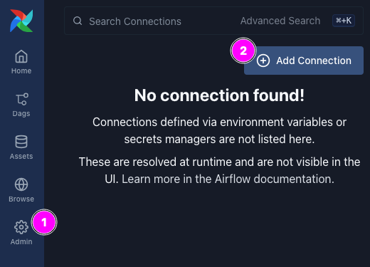
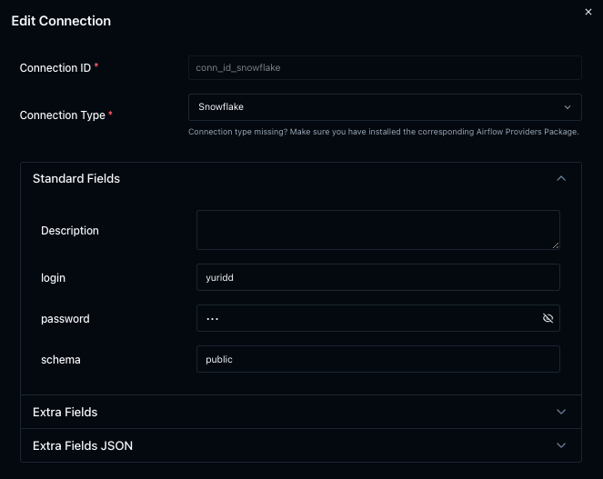
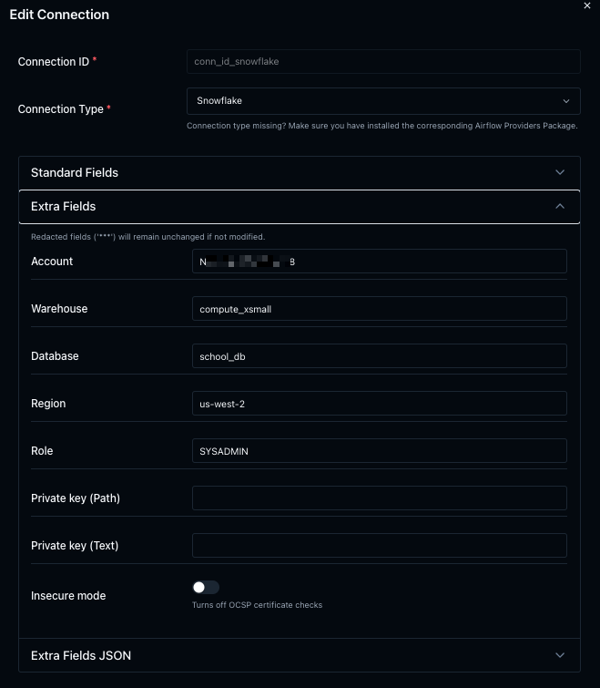
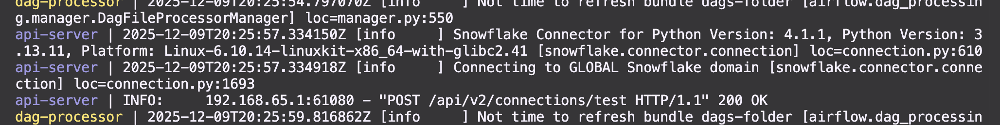

# DataEngineering: S3 to Snowflake with Email Notification using Apache Airflow 3

#airflow #snowflake #aws #s3 #ses #ec2 #conda #email 

# General

Creating a DAG using Apache Airflow3 for loading data from AWS S3 bucket to Snowflake with Email Notification on success.

Main goal of this project is to perform sequence of transformations and send email when finished. We will use Snowflake for transformation and will take  files from Amazon S3 bucket. I found the AWS SES service to be convenient given its low cost.

How DAG looks like in Apache Airflow3:

- Checking for the file's presence in S3
- Copying the file to the snowflake stage
- Creating a table
- Copying data from the stage to the table
- Sending an email upon successful completion of the entire DAG


# 1. Install Airflow3 in EC2

## 1.1 Running EC2

Go to `AWS Console` >> `EC2` >> `Instances` >> `Launch instances`

- Name : `ubuntu-airflow3`
- Application OS images : `Ubuntu 24.04`
- Instance type : `t2.large` (8 GiB memory or more...)
- Key pair : Create new key pair, download `.pem` for connection from your IDE (like VSCode)


- Network settings - Firewall : Create security group

Use defaults for the rest options. Push button `Launch instance` and connect to it when created using Public IP.


## 1.2 Environment

First of all check your python version:

```bash
python3 --version
Python 3.12.3
```

Creating application directory:

```bash
sudo apt update -y && sudo apt upgrade -y

sudo mkdir /app
sudo chown ubuntu /app

mkdir /app/airflow
mkdir /app/airflow/dags
cd /app/airflow
```

So now you have 2 paths:

- Use python env if you have already needed python version. 
- Use miniconda/anaconda if your default python have another version

Airflow v3.1.3 needs python version 3.13+, so i will use conda in this project.

### 1.2.1 python venv

```bash
python3 -m venv airflow_venv
source airflow_venv/bin/activate  
pip install --upgrade setuptools pip flask_builder
```

### 1.2.2 miniconda venv

Anaconda takes up more space than Miniconda. Installing miniconda:

```bash
wget https://repo.anaconda.com/miniconda/Miniconda3-latest-Linux-x86_64.sh -O ~/miniconda.sh
bash ~/miniconda.sh -b -p $HOME/miniconda
~/miniconda/bin/conda init bash
source ~/.bashrc   


conda config --add channels conda-forge
conda config --set channel_priority strict   
conda tos accept --override-channels --channel https://repo.anaconda.com/pkgs/main
conda tos accept --override-channels --channel https://repo.anaconda.com/pkgs/r

```

Creating Airflow venv.

```bash
conda create --name airflow_venv --yes 

conda install --name airflow_venv python=3.13 --yes

conda activate airflow_venv
pip install --upgrade setuptools pip flask_builder
```

## 1.3 Installing Apache Airflow

Creating Environment Variable. This way creates variables only in conda venv. If you want setup them not only for this venv, use commented commands below after deactivating conda. I think envs on venv level is more flexible and right choice.

```bash
conda env config vars set AIRFLOW_HOME=/app/airflow
conda env config vars set AIRFLOW__CORE__AUTH_MANAGER=airflow.providers.fab.auth_manager.fab_auth_manager.FabAuthManager

#export AIRFLOW_HOME=/app/airflow
#export AIRFLOW__CORE__AUTH_MANAGER=airflow.providers.fab.auth_manager.fab_auth_manager.FabAuthManager
```

Installing Apache Airflow. The last command can save your dependencies list like `pip freeze > requirements.txt`.

```bash
pip install apache-airflow==3.1.3 \
    apache-airflow-providers-fab==3.1.0 \
    apache-airflow-providers-snowflake==6.7.0 \
    aiohttp==3.13.2 \
    apache-airflow-providers-amazon==9.18.0
pip install connexion==2.14.2
pip install flask_appbuilder==5.0.2 flask_session

#conda env export > environment.yml
```

## 1.4 Configuring Apache Airflow

Creating Airflow configuration file:

```bash
airflow config list --defaults > "${AIRFLOW_HOME}/airflow.cfg"
```

Create secret(s) with (for JWT):

```bash
python -c "import secrets; print(secrets.token_urlsafe(32))"
```

Change in airflow.cfg next variables:

```bash
executor = LocalExecutor
auth_manager = airflow.providers.fab.auth_manager.fab_auth_manager.FabAuthManager

# Update JWT secret in config file
jwt_secret = {YOUR JWT SECRET}

# If you want CSRF token enabled generate another JWT token and update config file as follows
# secret_key = {YOUR 2nd-JWT SECRET}
```

Setting up Airflow:

```bash
airflow db migrate

airflow users create \
    --username admin \
    --firstname Yurii \
    --lastname DDDD \
    --role Admin \
    --email dddd@gg.wp \
    --password mypassword
```

## 1.5 Starting Airflow

Go to `AWS Console` >> `EC2` >> `Security Groups` >> Choose your security group name which belongs to your instance (for example `launch-wizard-1`) >> `Edit inbound rules`.

Add Custom TCP rule for 8080 port.


```bash
airflow api-server --port 8080
```

Connect to your IP address and port 8080 in browser.

## 1.6 Running Airflow as a Service

Next script will run all Airflow components and close them if necessary.

```bash
nano run_airflow.sh
```

```bash
#!/bin/bash
# Start Airflow
# Exit on any error
set -e

echo "Starting all Airflow components..."

# Start components in the background and store their PIDs
airflow scheduler &
PIDS[0]=$!

airflow dag-processor &
PIDS[1]=$!

airflow triggerer &
PIDS[2]=$!

airflow api-server --port 8080 &
PIDS[3]=$!

# Function to clean up and kill all background processes
cleanup () {
    echo "Shutting down all Airflow components..."
    for PID in ${PIDS[*]}; do
        kill $PID2>dev/null
    done
}

# Set a trap to run the cleanup function on script exit (e.g. Ctrl+C)
trap cleanup EXIT

# Wait for any background process to exit
wait -n

# Check the exit code of the process that finished
EXIT_CODE=$?
if [ $EXIT_CODE -ne 0 ]; then
    echo "A component failed with exit code $EXIT_CODE. Stopping all other components."
    # The 'trap' will handle the cleanup automatically
    exit $EXIT_CODE 
else
    "A component finished successfully. Shutting down."
fi

echo "All Airflow components have been stopped."
```

Add execute permission:

```bash
chmod +x run_airflow.sh
```

Now you can run all components by `run_airflow.sh`.

Creating service:

```bash
sudo nano /etc/systemd/system/airflow.service
```

```bash
[Unit]
Description = Apache Airflow Webserver Daemon
After = network.target

[Service]
# User=airflow
# Group=airflow
# Type=simple
PIDFile = /app/airflow/airflow.PIDFile
Environment=AIRFLOW_HOME=/app/airflow
Environment=PYHTONPATH=/app/airflow
WorkingDirectory = /app/airflow
ExecStart = /home/ubuntu/miniconda/condabin/conda run -n airflow_venv /app/airflow/run_airflow.sh
ExecStop = /bin/kill -s TERM $MAINPID

[Install]
WantedBy=multi-user.target
```

> In case when you use standard python venv replace `ExecStart = /home/ubuntu/miniconda/condabin/conda run -n airflow_venv /app/airflow/run_airflow.sh` with one‑liner that activates the venv and runs your script:

```bash
ExecStart = /bin/bash -c 'source /opt/airflow_venv/bin/activate && exec /app/airflow/run_airflow.sh'
```

Enable and Start services:

```bash
sudo systemctl daemon-reload
sudo systemctl enable airflow.service
sudo systemctl start airflow.service
```

Check status:

```bash
sudo systemctl status airflow.service
```

# 2. AWS Setup

## 2.1 AWS Connection

We will use Access Key for S3 bucket connection.

Go to `AWS Console` >> Top-right choose your account >> `Security credentials` >> `Access Key` >> `Create access key`.

You can own only two keys at once.


Now you should have:

Access key (example) : `AMIO6CSDKKKXKY8PP6ZD`

Secret access key (example) : `2amOdt1uTfqR/hJG2/oomb3AJMfN3dtSbFfS6VLxT`

## 2.2 AWS Airflow Connection

Go to `Airflow` >> `Admins` >> `Add Connection`



Fill in next fields:

- Connection id : `aws_s3_conn`
- Connection Type : `Amazon Web Services`
- AWS Access Key ID : `AMIO6CSDKKKXKY8PP6ZD`
- AWS Secret access Key : `2amOdt1uTfqR/hJG2/oomb3AJMfN3dtSbFfS6VLxT`
- Extra : `{"region_name": "us-east-1"}`

Of course use your AWS region, "us-east-1" is mine.

Save it.

## 2.3 Amazon Simple Email Service (SES)

Go to `AWS Console` >> `Amazon Simple Email Service` >> `Identities` >> `Create identity`.

- Identity type : `Email address`
- Email address (example) : `my_email@gmail.com`

Choose your real email. Amazon will fill headers with that email as "From:". Verify it.

There is no need to create another connection in Airflow for SES because we will use an existing one `aws_s3_conn`.

Update `email_backend` property in Airflow config ([source](https://airflow.apache.org/docs/apache-airflow/stable/howto/email-config.html#send-email-using-aws-ses)):

```bash
nano airflow.cfg

[email]
email_backend = airflow.providers.amazon.aws.utils.emailer.send_email
email_conn_id = aws_s3_conn
from_email = From email <my_email@gmail.com>
```

## 2.3 S3 Bucket

Go to `AWS Console` >> `S3` >> `Create bucket`.

- Bucket name (example) : `demo-airflow-snow-email`

For other options use defaults.

Create folder `books` and place [`books.csv`](books.csv) into.

# 3. Snowflake Setup

## 3.1 Database

Creating Database:

```sql
-- Choose your role
USE ROLE sysadmin;
--USE ROLE accountadmin;

-- Database
CREATE OR REPLACE DATABASE school_db;

USE DATABASE school_db;
USE SCHEMA public;
USE WAREHOUSE compute_xsmall;
```

Creating Staging directly connected to S3:

```sql
--
CREATE OR REPLACE STAGE school_db.public.s3_stage
URL = 's3://demo-airflow-snow-email'
CREDENTIALS = (
    AWS_KEY_ID = 'AMIO6CSDKKKXKY8PP6ZD', 
    AWS_SECRET_KEY = '2amOdt1uTfqR/hJG2/oomb3AJMfN3dtSbFfS6VLxT'
);
```

Check stage, there should be files:

```sql
LIST @school_db.public.s3_stage;
```

The better way is use [Snowflake Integration](https://github.com/yuriidd/e2e-dataengineering-aws-s3-and-snowflake-integration) either Access Keys.

## 3.2 Snowflake Airflow Connection

Go to `Airflow` >> `Admins` >> `Add Connection`

Fill:

- Standard Fields:
	- login
	- password
	- schema
- Extra Fields:
	- Account
	- Warehouse
	- Database
	- Region
	- Role





If your check Snowflake connection in Airflow you will see next rows in logs:



"200 OK" is nice ^.^

# 4. DAG

Create python file and place it to to `/app/airflow/dags` folder.

```python
from datetime import timedelta, datetime

from airflow import DAG
from airflow.providers.amazon.aws.sensors.s3 import S3KeySensor
from airflow.providers.common.sql.operators.sql import SQLExecuteQueryOperator 
from airflow.providers.amazon.aws.notifications.ses import SesNotifier


default_args = dict(
    owner = 'airflow',
    depends_on_past = False,
    email = ['airflow_admin@gg.wp'],
    email_on_failure = False,
    email_on_retry = False,
    retries = 2,
    retry_delay = timedelta(minutes=2),
    start_date = datetime(2025, 12, 8),
)

# S3 variables
s3_prefix = 's3://demo-airflow-snow-email/books/books.csv'
s3_bucket = None

# SES variables
SES_DEFAULTS = dict(
    aws_conn_id = 'aws_s3_conn',
    mail_from = 'my_email@gmail.com',
    to = 'my_email@gmail.com',
)


with DAG(
    's3_to_snowflake_with_email_notification',
    description = "Trigger S3 bucket to new files exist, load them to Snowflake and send email.",
    default_args = default_args,
    schedule = '@daily',
    catchup = False,
    tags = ['snowflake', 's3', 'email', 'notification', 'ses'],
    on_success_callback = SesNotifier(
        **SES_DEFAULTS, 
        subject = 'Airflow DAG s3_to_snowflake complete',
        html_content = 'DAG s3_to_snowflake completed successefuly!',
    )
                    ) as dag:


    # https://airflow.apache.org/docs/apache-airflow-providers-amazon/stable/_api/airflow/providers/amazon/aws/sensors/s3/index.html
    is_file_in_s3_available = S3KeySensor(
        task_id = 'task_is_file_in_s3_available',
        bucket_key = s3_prefix,
        bucket_name = s3_bucket,
        aws_conn_id = 'aws_s3_conn',
        poke_interval = 3
    )

	# https://airflow.apache.org/docs/apache-airflow-providers-snowflake/6.7.0/operators/index.html
    create_table = SQLExecuteQueryOperator(   
        task_id = 'task_create_table',
        conn_id = 'my_snowflake',
        sql = '''
            CREATE OR REPLACE TABLE public.books(
                book_id INT NOT NULL,
                title VARCHAR(420) NOT NULL,
                authors VARCHAR(255) NOT NULL,
                average_rating NUMBER(4, 2),
                isbn VARCHAR(255) NOT NULL UNIQUE,
                language_code VARCHAR(255),
                num_pages INT NOT NULL DEFAULT 0,
                ratings_count INT,
                text_reviews_count INT,
                publication_date DATE,
                publisher VARCHAR(255) NOT NULL
            );
        '''
    )


    copy_csv_from_stg_into_table = SQLExecuteQueryOperator(   
        task_id = 'task_copy_s3stg_to_table',
        conn_id = 'my_snowflake',
        sql = '''
            COPY INTO school_db.public.books
            FROM @school_db.public.s3_stage/books/books.csv 
            FILE_FORMAT = 'school_db.public.my_csv_format'
            ;
        '''
    )


    is_file_in_s3_available >> create_table >> copy_csv_from_stg_into_table
```

Refresh browser Airflow page and then you could find new DAG named `s3_to_snowflake_with_email_notification_etl`.

Trigger it.

Table was created in Snowflake.


And notification was sent "from my_email@gmail.com through amazonses.com" to "my_email@gmail.com".

